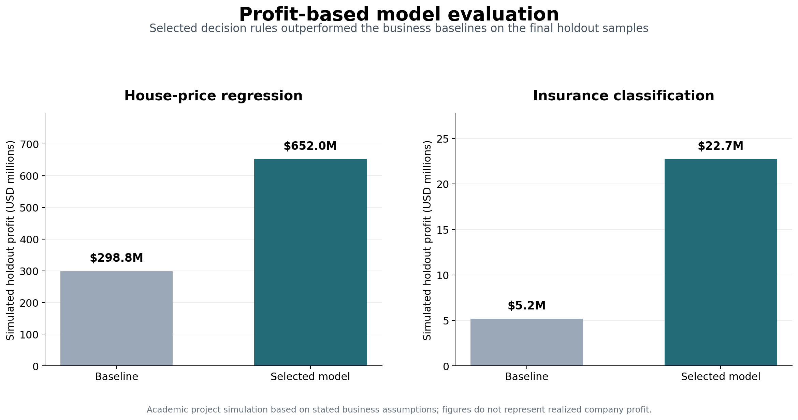

# Profit-Driven Machine Learning for Housing and Insurance Decisions

This repository is a portfolio adaptation of a two-person MSc course project completed for Machine Learning for Business at BI Norwegian Business School. The project received a grade of A.

## Project overview

The project applies machine learning to two related business problems using American Housing Survey data:

1. **House-price regression:** Predict residential property values using housing and location characteristics.
2. **Insurance classification:** Identify households likely to purchase insurance and evaluate model decisions based on expected profit.

The analysis focuses not only on predictive performance, but also on how machine-learning outputs can support practical business decisions.

## Key results

- The selected house-pricing decision rule increased simulated holdout profit by approximately 118.2% compared with the baseline.
- The selected TPOT-SMOTENC Random Forest Classifier used a profit-optimized threshold of approximately 0.1153 and increased simulated holdout profit by approximately 338.8%.
- Detailed results and assumptions are available in [`results/README.md`](results/README.md).


## Dataset

The analysis uses 51,808 household observations containing housing, demographic, income, and insurance-related characteristics.

The original datasets are not included due to course and data-sharing restrictions. Instructions for placing the files locally are provided in [`data/README.md`](data/README.md).

## Analytical workflow

### House-price regression

- Removed duplicates and separated the target from potential leakage variables.
- Standardized missing values and handled special survey response codes.
- Converted categorical and numerical variables to suitable data types.
- Applied train-only imputation and one-hot encoding.
- Used TPOT to search for a regression pipeline.
- Generated predictions on a holdout sample for business valuation.

### Insurance classification

- Removed the insurance amount variable from predictors to prevent target leakage.
- Created four additional features:
  - Housing cost-to-income ratio
  - Housing value-to-income ratio
  - Home age
  - Number of reported housing problems
- Split the data into training, valuation, and holdout samples using stratification.
- Compared random undersampling and SMOTENC for class imbalance.
- Used TPOT to search for classification pipelines.
- Evaluated model decisions using confusion matrices, predicted probabilities, and profit-based threshold analysis.
- Used DataRobot as an external benchmark; it is not required to run the Python workflow.

## Repository structure

```text
profit-driven-machine-learning/
├── data/
│   └── README.md
├── figures/
├── notebooks/
├── results/
├── src/
│   ├── house_price_regression.py
│   └── insurance_classification.py
├── .gitignore
├── README.md
└── requirements.txt
```

## Tools

- Python 3.10
- pandas and NumPy
- scikit-learn
- imbalanced-learn
- TPOT
- openpyxl
- DataRobot for external model comparison
- Excel for profit valuation

## My contribution

My direct contributions included:

- Data cleaning and preprocessing
- Target-leakage identification and handling
- Feature engineering
- Profit-based model valuation
- Interpretation and report writing

The original academic project was completed with one teammate. The teammate’s identity is omitted from this public portfolio version.

## How to run

1. Clone or download the repository.
2. Install the required packages:

```bash
pip install -r requirements.txt
```

3. Place the required datasets in the `data` folder as described in `data/README.md`.
4. Run either analysis:

```bash
python src/house_price_regression.py
python src/insurance_classification.py
```

TPOT performs an automated model search and may take considerable time depending on the computer.

## Reproducibility notes

- Randomized steps use `random_state=42`.
- Imputation is fitted on training data only.
- The holdout sample is reserved for final evaluation.
- Generated datasets and model outputs are excluded from GitHub.
- Package versions are pinned in `requirements.txt` for compatibility with the legacy TPOT workflow.

